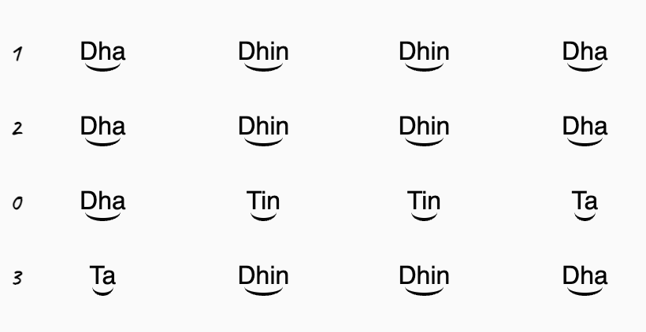

# \<palta-note>

\<palta-note> is a web component that displays compositions Bhatkhande notation system.

## Installation

```bash
npm i palta-note
```

## Usage

```html
<script type="module">
  import 'palta-note/palta-note.js';
</script>

<palta-note vibhags="1 2 0 3">
  Dha Dhin Dhin Dha
  Dha Dhin Dhin Dha
  Dha Tin Tin Ta
  Ta Dhin Dhin Dha
</palta-note>
```

The above should transform into:



You can also specify the taal and it will make sure that the matras fit into the correct structure of the taal:

```html
<palta-note taal="teental">
  Dha Dhin Dhin Dha Dha Dhin Dhin Dha
  Dha Tin Tin Ta
  Ta Dhin Dhin Dha
</palta-note>
```

which will produce the same output as above.

### Taals supported

\<palta-note> currently supports:
  - teental
  - rupak
  - ektaal
  - jhaptaal

### Shorthands

To save time with repeated matras or lines you can specify compositions like this:

```html
<palta-note taal="teental">
  Dha Dhin Dhin Dha x2
  Dha (Tin)x2 Ta
  Ta Dhin Dhin Dha
</palta-note>
```

This is equivalent to:

```html
<palta-note taal="teental">
  Dha Dhin Dhin Dha
  Dha Dhin Dhin Dha
  Dha Tin Tin Ta
  Ta Dhin Dhin Dha
</palta-note>
```


## Linting and formatting

To scan the project for linting and formatting errors, run

```bash
npm run lint
```

To automatically fix linting and formatting errors, run

```bash
npm run format
```

## Testing with Web Test Runner

To execute a single test run:

```bash
npm run test
```

To run the tests in interactive watch mode run:

```bash
npm run test:watch
```

## Local Demo

```bash
npm start
```

To run a local development server that serves the basic demo located in `index.html`
